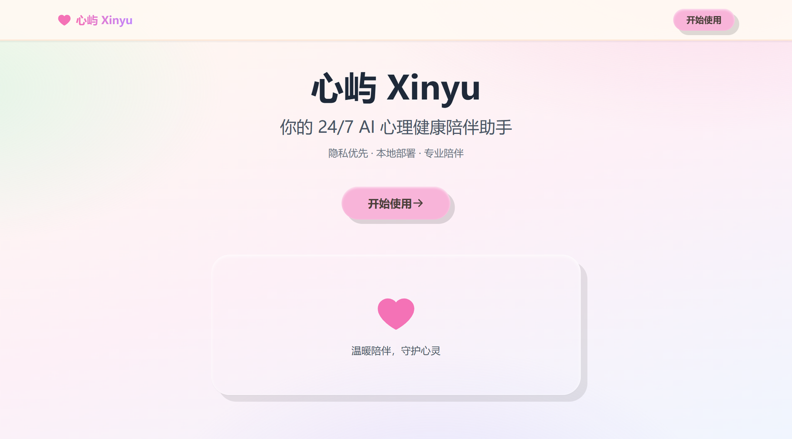
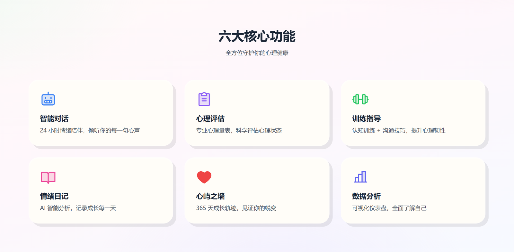
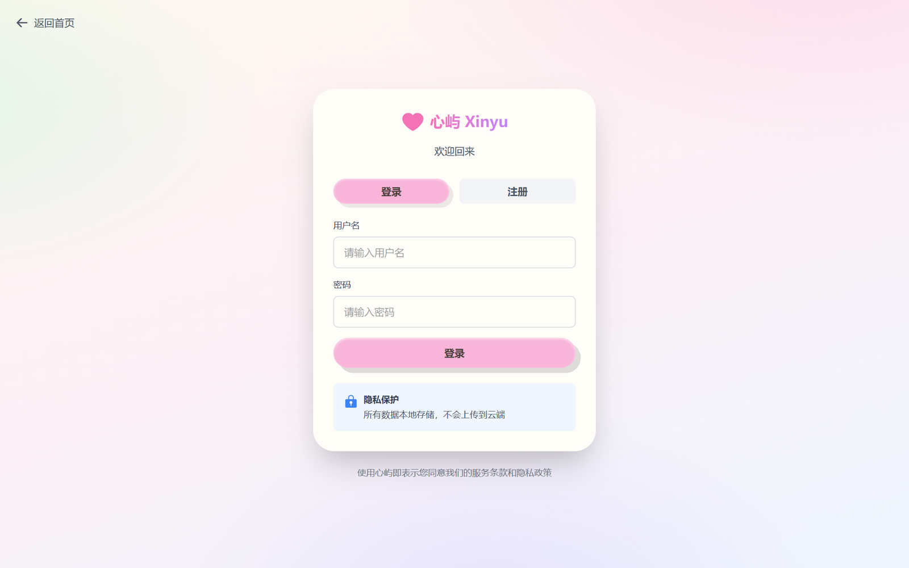
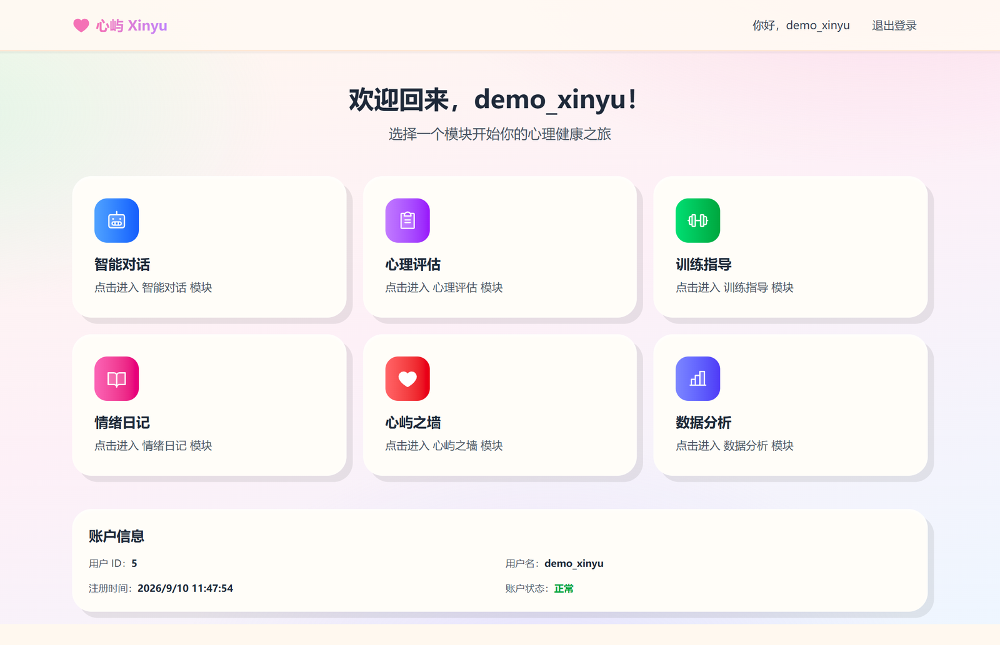
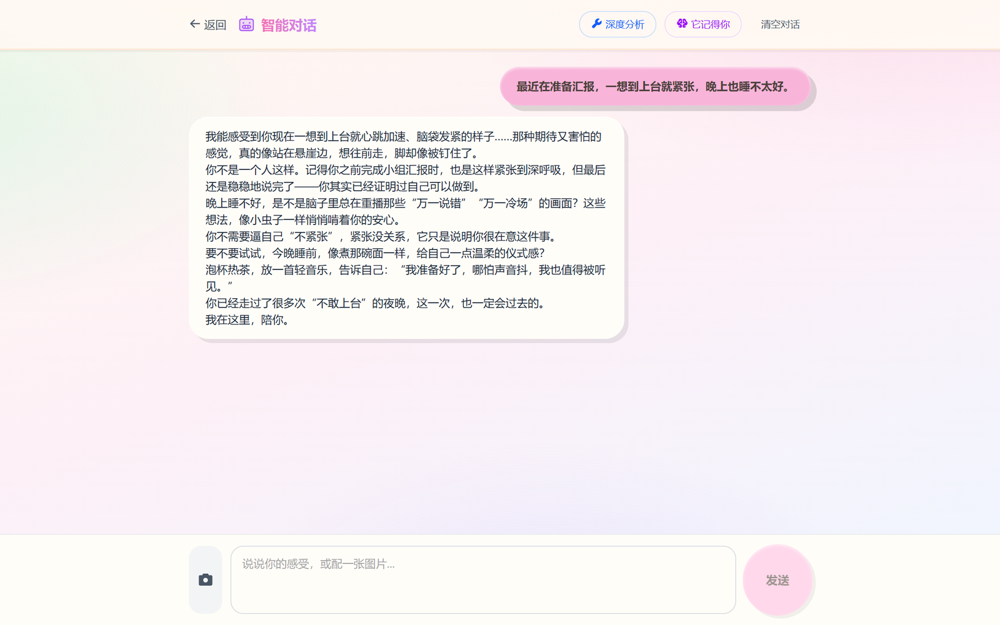
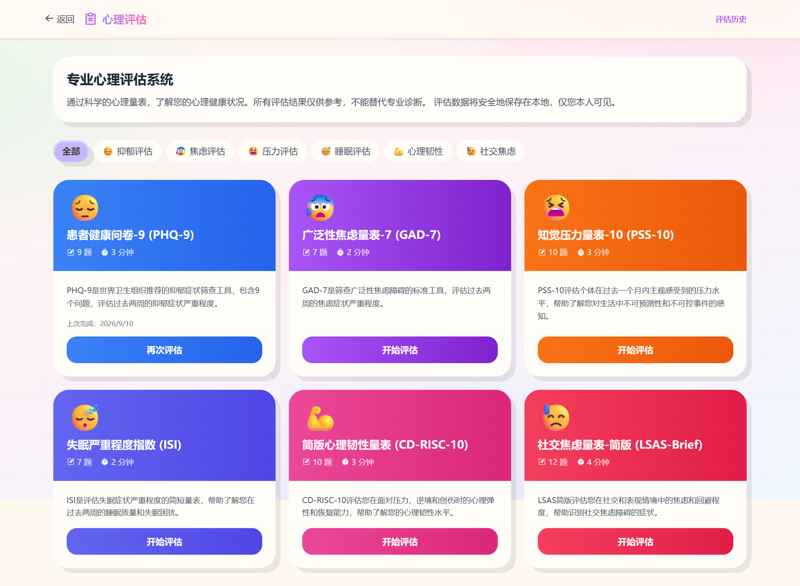
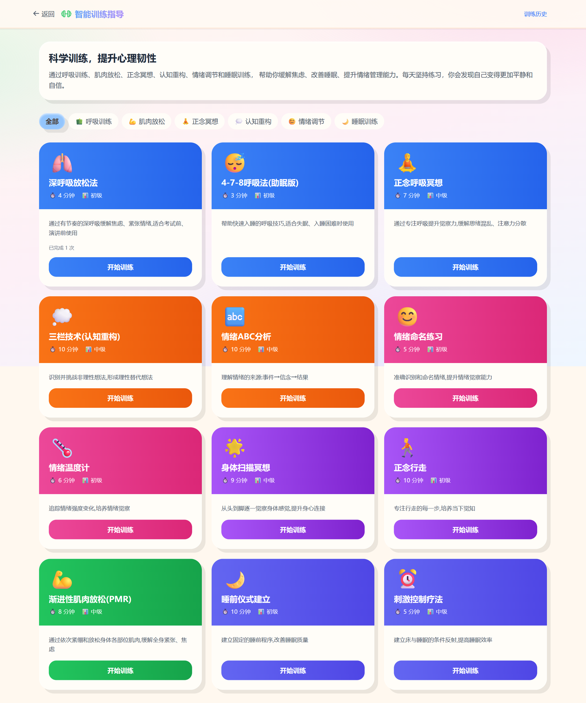
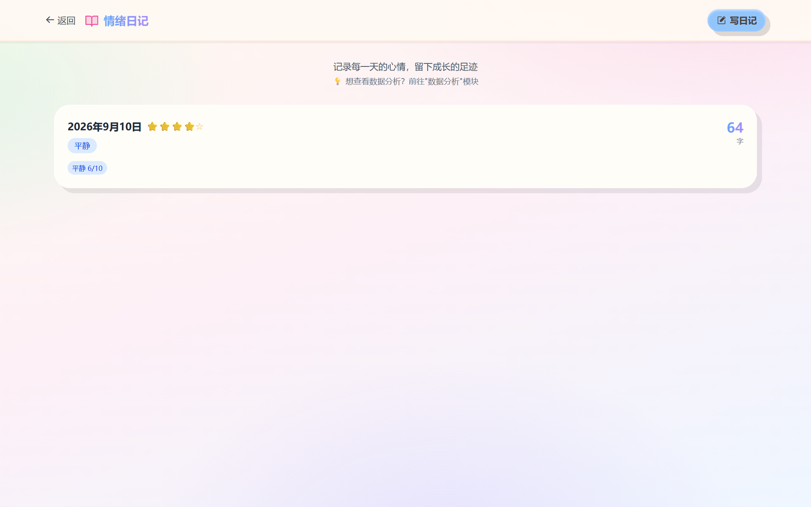
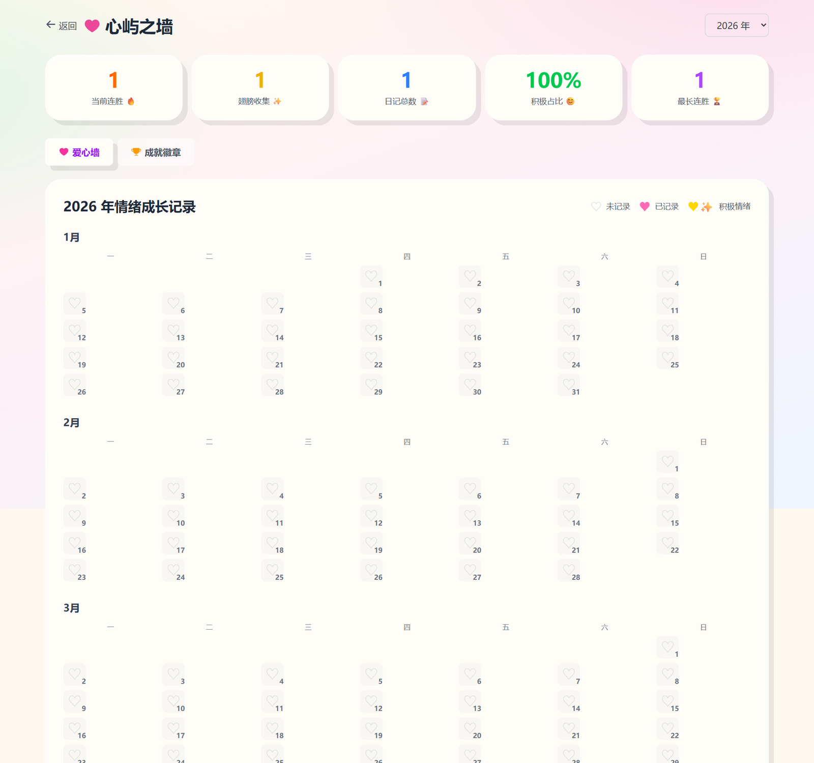
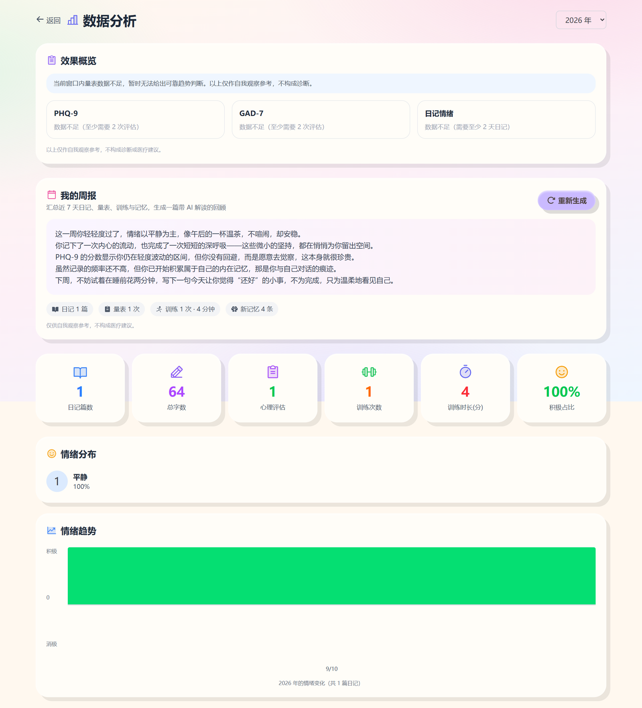

<div align="center">

<h1>💕 心屿 (XinYu) - AI 心理健康助手平台</h1>

</div>

<div align="center">

[](https://github.com/happy2377/xinyu)

[](LICENSE)
[](https://www.typescriptlang.org/)
[](https://nextjs.org/)
[](https://fastapi.tiangolo.com/)
[](https://www.python.org/)

**一个全功能的 AI 驱动心理健康管理平台，融合情绪日记、心理评估、智能对话、训练指导等功能**

[📖 项目简介](#-项目简介) • [✨ 功能特性](#-功能特性) • [🏗️ 技术架构](#️-技术架构) • [📸 界面预览](#-界面预览) • [🚀 快速开始](#-快速开始) • [📖 技术文档](#-技术文档) 

</div>


## 📖 项目简介

**心屿（Xinyu）** 是面向大学生用户的本地化 AI 心理健康陪伴与管理系统。系统采用**感知—评估—干预**闭环，为用户提供全天候（24/7）的情绪陪伴、心理评估、个性化训练与成长任务。项目强调数据隐私（本地化部署），并保留通过受控远端大模型（如 ModelScope / Ollama Hub）进行更复杂推理的能力。

核心目标：
- 为大学生提供稳定、专业、可解释的心理支持与训练引导
- 在保证隐私的前提下，兼顾对话质量与可部署性（GPU/CPU）
- 易维护、模块化、可逐步迭代的智能体框架

### 🎯 核心价值

- 🤖 **AI 驱动**：集成大语言模型，提供智能情绪分析和对话支持
- 🔬 **专业性**：基于心理学标准量表（PHQ-9、GAD-7、PSS-10 等）
- 📊 **数据驱动**：可视化追踪情绪变化，量化心理健康成长
- 🎮 **游戏化**：连胜、成就、翅膀收集等机制提升用户粘性
- 🛡️ **隐私安全**：本地部署，数据完全自主可控

### 🏆 项目亮点

- ✅ **模块化架构**：6 大核心模块，清晰的前后端分离设计
- ✅ **AI 多模型支持**：可配置 Ollama、modelscope 等多种 LLM
- ✅ **完整的用户体系**：JWT 鉴权、用户注册登录、权限管理
- ✅ **丰富的可视化**：情绪趋势图、爱心墙日历、统计看板等
- ✅ **专业评估量表**：内置 6 种标准心理学量表
- ✅ **心理训练课程**：6 大类训练技术，超过 20 个训练模板


## ✨ 功能特性

### 💬 智能对话模块
- **多轮对话**：支持上下文连续对话
- **情绪感知**：识别用户情绪状态并动态调整回应策略
- **专业知识库**：整合心理学专业知识
- **对话历史**：保存和查看历史对话记录
- **多模型切换**：支持 Ollama/modelscope

### 🧠 心理评估模块
- **标准量表评估**：
  - PHQ-9（抑郁症状筛查）
  - GAD-7（广泛性焦虑筛查）
  - PSS-10（压力知觉量表）
  - ISI（失眠严重程度指数）
  - SWLS（生活满意度量表）
  - RSES（自尊量表）
- **智能结果解读**：AI 生成个性化评估报告
- **趋势追踪**：可视化历史评估结果变化
- **风险预警**：根据量表分数提供风险等级提示

### 🏋️ 训练指导模块
- **6 大训练类型**：
  - 🌬️ 呼吸放松训练
  - 💪 渐进式肌肉放松
  - 🧘 正念冥想训练
  - 🧠 认知重构训练
  - 💖 情绪调节训练
  - 😴 睡眠改善训练
- **详细步骤指导**：每个训练包含完整的分步指引
- **训练记录**：自动记录训练时长和完成情况
- **个性化推荐**：基于评估结果推荐适合的训练课程

### 📝 情绪日记模块
- **智能模板引导**：提供多种日记模板（感恩日记、情绪觉察、压力管理等）
- **AI 情绪分析**：自动识别情绪类型和强度（12 种情绪分类）
- **个性化建议**：基于 AI 分析提供情绪调节建议
- **历史记录管理**：支持查看、编辑、删除历史日记

### 💕 心屿之墙模块
- **可视化日历墙**：全年 365 天日记记录一目了然
- **三态爱心系统**：
  - ♡ 空心（未记录）
  - ♥ 粉色实心（已记录）
  - ♥✨ 金色翅膀（积极情绪）
- **游戏化机制**：
  - 🔥 连胜系统（连续记录天数）
  - ✨ 翅膀收集（积极情绪次数）
  - 🏆 成就徽章（12 种成就类型）
- **统计看板**：5 维度成长数据可视化

### 📊 数据分析模块
- **年度统计看板**：6 大核心指标
  - 📝 日记篇数
  - ✍️ 总字数
  - 📋 心理评估次数
  - 🏋️ 训练次数
  - ⏱️ 训练总时长
  - 😊 积极情绪占比
- **情绪分布分析**：12 种情绪的频率和占比
- **双向趋势图**：积极/消极情绪随时间变化
- **跨年度对比**：支持查看历史年份数据

## 🏗️ 技术架构

### 技术栈

#### 前端
```
框架：Next.js 16 (App Router)
语言：TypeScript 5.0
样式：Tailwind CSS
状态管理：React Hooks
HTTP 客户端：Fetch API
```

#### 后端
```
框架：FastAPI 0.121+
语言：Python 3.13+
数据库：SQLite + SQLAlchemy ORM
认证：JWT (JSON Web Tokens)
AI：Ollama / 魔搭
```

### 系统架构图

```
用户浏览器
    ↓
Next.js 前端 (localhost:3000)
    ├─ 首页（Landing Page）
    ├─ 登录/注册页
    └─ 主界面（Dashboard with 6 Modules）
    ↓
FastAPI 后端 (localhost:8000)
    ├─ 认证路由 (/api/auth)
    ├─ 对话路由 (/api/chat)
    ├─ 评估路由 (/api/assessment)
    ├─ 训练路由 (/api/training)
    ├─ 日记路由 (/api/diary)
    ├─ 成长路由 (/api/growth)
    └─ 分析路由 (/api/analytics)
    ↓
MultiAgentCoordinator（智能体协调器）
    ↓
ModelRouter（模型路由器）
    ├─ LocalModelService（Ollama 本地模型）
    └─ RemoteModelService（ModelScope 云端模型）
    ↓
SQLite 数据库（本地存储）
```

```
┌──────────────────────────────────────────────────────────────┐
│                   Frontend Layer (Next.js)                   │
│    ┌──────────┐ ┌──────────┐ ┌──────────┐ ┌──────────┐       │
│    │  Diary   │ │Assessment│ │   Chat   │ │ Training │       │
│    │  Module  │ │  Module  │ │  Module  │ │  Module  │       │
│    └────┬─────┘ └────┬─────┘ └────┬─────┘ └────┬─────┘       │
│         │            │            │            │             │
│         | ┌──────────┐            ┌───────────┐|             │
│         | │  Growth  │            │ Analytics │|             │
│         | │   Wall   │            │  Module   │|             │
│         | └────┬─────┘            └─────┬─────┘|             │
│         │      |     │            |     |      |             │
└─────────┼──────|─────┼────────────|─────|──────|─────────────┘
          │      |     │            |     |      |
          │      |    HTTP REST API (JSON)|      | 
          │      |     │            |     |      |
┌─────────┼──────|─────┼────────────|─────|──────|─────────────┐
│         │      |   Backend Layer (FastAPI)     |             │
│         ▼      ▼     ▼            ▼     ▼      ▼             │
│   ┌─────────────────────────────────────────────────────┐    │
│   │                 API Router Layer                    │    │
│   │     /auth  /diary  /assessment  /training  /chat    │    │
│   │                /growth  /analytics                  │    │
│   └─────────────────────┬───────────────────────────────┘    │
│                         │                                    │
│   ┌─────────────────────┴───────────────────────────────┐    │
│   │            Business Logic Layer                     │    │
│   │    - AI Emotion Analysis Service                    │    │
│   │    - Intelligent Dialogue Coordinator (Multi-Agent) │    │
│   │    - Assessment Result Interpretation               │    │
│   │    - Achievement Unlock Detection                   │    │
│   └─────────────────────┬───────────────────────────────┘    │
│                         │                                    │
│   ┌─────────────────────┴───────────────────────────────┐    │
│   │        Data Access Layer (SQLAlchemy ORM)           │    │
│   └─────────────────────┬───────────────────────────────┘    │
│                         │                                    │
│   ┌─────────────────────┴───────────────────────────────┐    │
│   │            SQLite Database (xinyu.db)               │    │
│   │    ┌────────┐ ┌────────┐ ┌────────┐ ┌────────┐      │    │
│   │    │ users  │ │diaries │ │assessmt│ │training│      │    │
│   │    └────────┘ └────────┘ └────────┘ └────────┘      │    │
│   │    ┌────────┐ ┌────────┐ ┌────────┐                 │    │
│   │    │ growth │ │achieve │ │ chats  │                 │    │
│   │    └────────┘ └────────┘ └────────┘                 │    │
│   └─────────────────────────────────────────────────────┘    │
└──────────────────────────────────────────────────────────────┘
                          │
                          ▼
              ┌───────────────────────┐
              │  External AI Services │
              │  - Ollama (Local)     │
              │  - ModelScope         │
              └───────────────────────┘
```

## 🚀 快速开始

### 环境要求

- **Node.js**: >= 18.0.0
- **Python**: >= 3.13
- **Ollama**: >= 0.6.1

### 安装步骤

#### 1. 克隆项目

```bash
git clone https://github.com/happy2377/xinyu.git
cd xinyu
```

#### 2. Ollama 设置

使用本地 AI 模型：安装 Ollama

下载安装包: https://ollama.com/download  

进入ollama官网主页，选择对应的操作系统下载安装即可。

```bash
# 拉取推荐模型
ollama pull Ethanwhh/Qwen3-4B-xinyu

# 启动 Ollama 服务
ollama serve
```

#### 3. 魔搭环境设置

复制.env.example 文件新建为.env文件并填入自己的api_key

在your_api_key_here填入你的api_key,在魔搭平台首页中的访问令牌可以找到。

#### 4. 启动后端

```bash
# 进入后端目录
cd backend

# 安装 UV 包管理器（如果没有）
pip install uv

# 安装所有依赖（首次需要2-3分钟）
uv sync

# 启动后端服务
uv run main.py
```

#### 5. 启动前端

```bash
# 进入前端目录
cd xinyu/frontend

# 安装依赖（首次需要3-5分钟）
npm install

# 启动前端服务，dev模式下可以进行开发和修改，并能够实时查看更新
npm run dev

# 如果修改完成可以进入生产模式，性能更快，文件更小
Ctrl+C          # 停止开发服务器
npm run build   # 构建（3-5分钟，只需一次）
npm start       # 启动生产服务器
```

### 用户流程

```
用户访问 http://localhost:3000
    ↓
【首页】项目介绍页面
    - 展示"心屿"项目简介、核心功能、设计理念
    - 显示"开始使用"按钮
    ↓
点击"开始使用"按钮
    ↓
【登录/注册页】
    - 新用户：注册账号
    - 老用户：直接登录
    ↓
登录成功
    ↓
【主界面】六大功能板块导航
    ├─ 1️⃣ 智能对话
    ├─ 2️⃣ 心理评估
    ├─ 3️⃣ 训练指导
    ├─ 4️⃣ 情绪日记
    ├─ 5️⃣ 心屿之墙
    └─ 6️⃣ 数据分析
    ↓
用户点击任意板块开始使用
```

## 📸 界面预览

### 心屿介绍 
> 项目简介 + 核心功能 + 设计理念




### 用户登录
> 新用户进行注册 + 老用户进行登录


### 首页 
> 统一的功能入口，6 大模块卡片式导航


### 智能对话
> 多轮对话 + 情绪感知 + 专业支持


### 心理评估
> 标准量表 + 智能解读 + 趋势追踪


### 训练指导
> 6 大训练类型 + 详细步骤 + 训练记录


### 情绪日记
> 智能模板引导 + AI 情绪分析 + 历史记录管理


### 心屿之墙
> 可视化日历 + 游戏化机制 + 成就徽章


### 数据分析
> 统计看板 + 情绪分布 + 双向趋势图


## 📖 技术文档

### [心屿大模型(Qwen3-4B-xinyu)](https://www.modelscope.cn/models/Ethanwhh/Qwen3-4B-xinyu/summary)

**智能对话** 模块的本地ollama大模型使用的是 **Qwen3-4B-xinyu** 。

#### 模型数据

本模型的基模型采用的是 **通义千问3-4B-Instruct-2507** ，具体详情可见：https://www.modelscope.cn/models/Qwen/Qwen3-4B-Instruct-2507/summary 。

数据集构造参考 **SoulChat2.0** 的数据构造方式，具体可见：https://github.com/scutcyr/SoulChat2.0 。

#### 模型使用

模型下载方式可以参考：https://modelscope.cn/docs/models/download 。

心屿项目主要是为了隐私化和本地部署，该模型已经上传 **ollama** ，大家也可以通过 **ollama** 本地部署使用，模型地址：https://ollama.com/Ethanwhh/Qwen3-4B-xinyu 。

#### 限制声明

- 本项目开源的模型基于开源基座模型微调得到，使用模型权重时，请遵循对应基座模型的模型协议：[Qwen](https://github.com/QwenLM/Qwen/blob/main/Tongyi%20Qianwen%20LICENSE%20AGREEMENT) 
- **心屿** 是一个心理健康辅助工具，旨在帮助用户更好地理解和管理自己的情绪状态。但请注意：
- ⚠️ 本平台 **不能** 替代专业的心理咨询和治疗
- ⚠️ 如果您正在经历严重的心理健康问题，请及时寻求专业帮助
- ⚠️ 评估结果仅供参考，不作为诊断依据
- ⚠️ AI 生成的建议仅供参考，不构成医疗建议

#### 致谢

本项目基于[Qwen3-4B-Instruct-2507](https://www.modelscope.cn/models/Qwen/Qwen3-4B-Instruct-2507/summary)基座模型，通过[SoulChat2.0](https://github.com/scutcyr/SoulChat2.0)相关数据集基于[LLaMA-Factory](https://github.com/hiyouga/LLaMA-Factory)框架lora微调得到，感谢开源和作者的付出。


### 💬 智能对话模块技术文档

智能对话模块是心屿项目的核心功能，提供**24小时在线心理陪伴服务**。通过多智能体协作和动态模型路由，实现：
- 🎭 **三阶段情绪引导**：从感性安慰 → 理性思考 → 问题解决
- 🔒 **隐私保护机制**：敏感话题强制本地模型处理
- 🧠 **智能模型路由**：复杂问题调用云端大模型
- 🆘 **危机干预系统**：检测自杀/暴力倾向并提供紧急资源

**整体架构图**：

```
┌─────────────────────────────────────────────────────────────────┐
│                      User Interface Layer                       │
│  ┌─────────────────────────────────────────────────────────┐    │
│  │  chat/page.tsx                                          │    │
│  │  - Message Rendering (Markdown support)                 │    │
│  │  - SSE Stream Reception                                 │    │
│  │  - Crisis Message Display                               │    │
│  └─────────────────────────────────────────────────────────┘    │
└─────────────────────────────────────────────────────────────────┘
                              ↓ HTTP/SSE
┌─────────────────────────────────────────────────────────────────┐
│                         API Router Layer                        │
│  ┌─────────────────────────────────────────────────────────┐    │
│  │  routers/chat.py                                        │    │
│  │  - POST /api/chat/send  (Send message)                  │    │
│  │  - GET /api/chat/active (Get active chat)               │    │
│  │  - DELETE /api/chat/clear (Clear chat)                  │    │
│  └─────────────────────────────────────────────────────────┘    │
└─────────────────────────────────────────────────────────────────┘
                              ↓
┌─────────────────────────────────────────────────────────────────┐
│                  Multi-Agent Coordination Layer                 │
│  ┌─────────────────────────────────────────────────────────┐    │
│  │  coordinator.py (MultiAgentCoordinator)                 │    │
│  │  ┌────────────────────────────────────────────────────┐ │    │
│  │  │  Core Process (8 Steps)                            │ │    │
│  │  │  1. Get/Create Conversation                        │ │    │
│  │  │  2. Save User Message                              │ │    │
│  │  │  3. Get Conversation History                       │ │    │
│  │  │  4. Perception Planning (Dual-layer judgment)      │ │    │
│  │  │  5. Crisis Detection                               │ │    │
│  │  │  6. Phase Management                               │ │    │
│  │  │  7. Model Routing                                  │ │    │
│  │  │  8. Generate & Save Response                       │ │    │
│  │  └────────────────────────────────────────────────────┘ │    │
│  └─────────────────────────────────────────────────────────┘    │
└─────────────────────────────────────────────────────────────────┘
        ↓                    ↓                    ↓
┌──────────────┐   ┌──────────────────┐   ┌──────────────────┐
│ Perception   │   │  Phase Manager   │   │  Model Router    │
├──────────────┤   ├──────────────────┤   ├──────────────────┤
│perception_   │   │ phase_manager.py │   │ model_router.py  │
│planning.py   │   │                  │   │                  │
│              │   │ - Phase Judge    │   │ - Local Service  │
│- Privacy Det │   │ - Phase Transit  │   │ - Cloud Service  │
│- Complexity  │   │ - Trigger Words  │   │ - Route Decision │
│- Crisis Det  │   │                  │   │                  │
└──────────────┘   └──────────────────┘   └──────────────────┘
        ↓                                          ↓
┌──────────────────────────────────────────────────────────────┐
│                        AI Model Layer                        │
│  ┌───────────────────────┐      ┌──────────────────────────┐ │
│  │  Local Model (Ollama) │      │  Cloud Model (ModelScope)│ │
│  │ethanwhh/Qwen3-4b-xinyu│      │  Qwen3-Next-80B-A3B      │ │
│  │  - Privacy Chat       │      │  - Complex Issues        │ │
│  │  - Simple Consult     │      │  - Detailed Solutions    │ │
│  │  - Fast Response      │      │  - Deep Analysis         │ │
│  └───────────────────────┘      └──────────────────────────┘ │
└──────────────────────────────────────────────────────────────┘
                              ↓
┌─────────────────────────────────────────────────────────────────┐
│                    Data Persistence Layer                       │
│  ┌─────────────────────────────────────────────────────────┐    │
│  │  SQLite Database                                        │    │
│  │  - conversations (Conversations Table)                  │    │
│  │  - messages (Messages Table)                            │    │
│  └─────────────────────────────────────────────────────────┘    │
└─────────────────────────────────────────────────────────────────┘
```

### 🧠 心理评估模块技术文档

心理评估模块是心屿项目的核心功能之一，提供**专业标准化的心理测评服务**。通过国际公认的心理量表，帮助用户科学评估自己的心理健康状况，并提供个性化的建议和干预方案
- 🎯 **科学准确** - 采用国际标准化量表，确保评估的专业性和可靠性
- 📊 **智能评分** - 自动计算总分并判断风险等级，提供详细的结果解释
- 📈 **趋势追踪** - 记录历史评估数据，支持趋势分析和长期监测
- 🔒 **隐私保护** - 所有评估数据仅用户本人可见，本地存储安全可靠
- 🎨 **用户友好** - 单题展示、进度提示、退出保护，优化评估体验

**整体架构图**：

```
┌─────────────────────────────────────────────────────────────┐
│                     User Interface Layer                    │
│  ┌────────────┐  ┌────────────┐  ┌────────────┐  ┌────────┐ │
│  │ Scale List │  │ Assessment │  │   Result   │  │History │ │
│  │ page.tsx   │  │ [id]/page  │  │result/[id] │  │history │ │
│  └────────────┘  └────────────┘  └────────────┘  └────────┘ │
└─────────────────────────────────────────────────────────────┘
                          ↓ HTTP/REST
┌─────────────────────────────────────────────────────────────┐
│                       API Router Layer                      │
│  ┌──────────────────────────────────────────────────────┐   │
│  │  routers/assessment.py                               │   │
│  │  ┌────────────┬────────────┬────────────┬─────────┐  │   │
│  │  │GET /list   │GET /{id}   │POST /submit│GET /his │  │   │
│  │  │Scale List  │Questions   │Submit      │History  │  │   │
│  │  └────────────┴────────────┴────────────┴─────────┘  │   │
│  └──────────────────────────────────────────────────────┘   │
└─────────────────────────────────────────────────────────────┘
                          ↓
┌─────────────────────────────────────────────────────────────┐
│                   Business Logic Layer                      │
│  ┌──────────────────────────────────────────────────────┐   │
│  │  Core Functions                                      │   │
│  │  • Scale Template Management (6 standard scales)     │   │
│  │  • Auto Initialization (first access creates data)   │   │
│  │  • Score Calculation (sum method)                    │   │
│  │  • Risk Level Judgment (based on score ranges)       │   │
│  │  • Result Interpretation Generation                  │   │
│  │  • History Tracking                                  │   │
│  │  • Trend Data Generation                             │   │
│  └──────────────────────────────────────────────────────┘   │
└─────────────────────────────────────────────────────────────┘
                          ↓
┌─────────────────────────────────────────────────────────────┐
│                   Data Persistence Layer                    │
│  ┌──────────────────────┐    ┌─────────────────────────┐    │
│  │ assessment_templates │    │ assessment_records      │    │
│  │ (Scale Templates)    │    │ (Assessment Records)    │    │
│  │ • scale_name         │    │ • user_id               │    │
│  │ • questions (JSON)   │◄───┤ • template_id           │    │
│  │ • scoring_rules      │    │ • answers (JSON)        │    │
│  │ • interpretation     │    │ • total_score           │    │
│  │ • category           │    │ • risk_level            │    │
│  └──────────────────────┘    └─────────────────────────┘    │
└─────────────────────────────────────────────────────────────┘
```

### 🏋️ 训练指导模块技术文档

智能训练指导模块为用户提供系统化、个性化的心理健康训练方案：
- **12种科学训练方法** - 涵盖呼吸、放松、冥想、认知、情绪、睡眠6大领域
- **实时训练引导** - 倒计时、分步指导、进度追踪
- **训练记录追踪** - 自动记录训练时长、评分、感受
- **数据统计分析** - 训练次数、时长、类型分布可视化
- **训练计划管理** - 创建个性化训练计划，设置提醒

**整体架构图**：

```
┌─────────────────────────────────────────────────────────────┐
│                      User Interface Layer                   │
│  ┌──────────────┬──────────────┬──────────────────────┐     │
│  │  Training    │   Training   │   Training           │     │
│  │  List Page   │   Detail Page│   History Page       │     │
│  │  (Next.js)   │   (Timer)    │   (Statistics)       │     │
│  └──────────────┴──────────────┴──────────────────────┘     │
└─────────────────────────────────────────────────────────────┘
                            ↕ HTTP/JSON
┌─────────────────────────────────────────────────────────────┐
│                      API Service Layer                      │
│  ┌──────────────────────────────────────────────────────┐   │
│  │           FastAPI RESTful API                        │   │
│  │  • GET  /api/training/list          (List)           │   │
│  │  • GET  /api/training/{id}          (Detail)         │   │
│  │  • POST /api/training/complete      (Complete)       │   │
│  │  • GET  /api/training/records       (Records)        │   │
│  │  • GET  /api/training/statistics    (Statistics)     │   │
│  │  • POST /api/training/plan/create   (Create Plan)    │   │
│  └──────────────────────────────────────────────────────┘   │
└─────────────────────────────────────────────────────────────┘
                            ↕ SQLAlchemy ORM
┌─────────────────────────────────────────────────────────────┐
│                   Data Persistence Layer                    │
│  ┌─────────────────┬────────────────┬──────────────────┐    │
│  │ TrainingTemplate│ TrainingRecord │  TrainingPlan    │    │
│  │  (Template Tbl) │  (Record Tbl)  │  (Plan Table)    │    │
│  └─────────────────┴────────────────┴──────────────────┘    │
│                      SQLite Database                        │
└─────────────────────────────────────────────────────────────┘
```

### 📝 情绪日记模块技术文档

情绪日记模块为用户提供全方位的情绪记录和智能分析：
- **多维度情绪记录** - 12种情绪类型 + 强度评估 + 触发事件
- **AI智能分析** - 基于Ollama本地大模型的专业心理学分析
- **专业日记模板** - 5种CBT风格模板（感恩、压力释放、人际冲突等）
- **引导式写作** - 15个深度思考问题随机展示
- **生活维度评估** - 睡眠、饮食、运动、社交、工作效率5维度记录
- **成长追踪联动** - 自动同步到"心屿之墙"，可视化情绪趋势
- **成就系统触发** - 写日记自动解锁成就（连续打卡、百日记录等）

**整体架构图**：

```
┌─────────────────────────────────────────────────────────────┐
│                     User Interface Layer                    │
│  ┌──────────────┬──────────────┬──────────────────────┐     │
│  │  Diary List  │  Write Page  │   Detail Page        │     │
│  │  (Next.js)   │ (AI Feedback)│   (Full Analysis)    │     │
│  └──────────────┴──────────────┴──────────────────────┘     │
└─────────────────────────────────────────────────────────────┘
                            ↕ HTTP/JSON
┌─────────────────────────────────────────────────────────────┐
│                       API Service Layer                     │
│  ┌──────────────────────────────────────────────────────┐   │
│  │           FastAPI RESTful API                        │   │
│  │  • POST /api/diary/create          (Create + AI)     │   │
│  │  • GET  /api/diary/list            (List diaries)    │   │
│  │  • GET  /api/diary/{id}            (Get detail)      │   │
│  │  • PUT  /api/diary/{id}            (Update)          │   │
│  │  • DELETE /api/diary/{id}          (Delete)          │   │
│  │  • GET  /api/diary/templates/list  (Templates)       │   │
│  │  • GET  /api/diary/guided-questions (Questions)      │   │
│  └──────────────────────────────────────────────────────┘   │
└─────────────────────────────────────────────────────────────┘
                            ↕ SQLAlchemy ORM
┌─────────────────────────────────────────────────────────────┐
│                   Data Persistence Layer                    │
│  ┌─────────────────┬────────────────┬──────────────────┐    │
│  │     Diary       │ GrowthRecord   │  Achievement     │    │
│  │   (Diary Data)  │ (Growth Data)  │ (Achievement)    │    │
│  └─────────────────┴────────────────┴──────────────────┘    │
│                      SQLite Database                        │
└─────────────────────────────────────────────────────────────┘
                            ↕ HTTP
┌─────────────────────────────────────────────────────────────┐
│                        AI Analysis Layer                    │
│  ┌──────────────────────────────────────────────────────┐   │
│  │              Ollama Local LLM                        │   │
│  │          Qwen3-4B-xinyu (Mental Health Model)        │   │
│  │                                                      │   │
│  │  Fallback: Rule-based Engine                         │   │
│  └──────────────────────────────────────────────────────┘   │
└─────────────────────────────────────────────────────────────┘
```

### 💕 心屿之墙模块技术文档

心屿之墙是一个情绪可视化日历系统，将用户的日记记录转化为直观的爱心图标墙，通过连胜、翅膀收集、成就徽章等游戏化元素，激励用户持续记录和反思情绪状态。
- 📅 **年度日历墙**：按月份展示全年日记记录，一目了然
- 💝 **三态爱心**：空心（未记录）、粉色实心（已记录）、金色翅膀（积极情绪）
- 🔥 **连胜系统**：追踪连续记录天数，激励每日坚持
- 🏆 **成就徽章**：12 种成就类型，记录成长里程碑
- 📊 **统计看板**：5 维度数据可视化，量化情绪成长

**整体架构图**：

```
┌─────────────────────────────────────────────────────────┐
│                Growth Page (Frontend)                   │
│  ┌──────────────┐  ┌──────────────┐  ┌──────────────┐   │
│  │  Heart Wall  │  │ Achievement  │  │  Statistics  │   │
│  │  View        │  │  Badges View │  │  Cards       │   │
│  └──────┬───────┘  └───────┬──────┘  └────────┬─────┘   │
│         │                  │                  │         │
│         └──────────────────┴──────────────────┘         │
│                            │                            │
└────────────────────────────┼────────────────────────────┘
                             │ HTTP REST API
┌────────────────────────────┼─────────────────────────────┐
│                            ▼                             │
│              FastAPI Router (/api/growth)                │
│  ┌──────────────┐  ┌──────────────┐  ┌──────────────┐    │
│  │  Heart Wall  │  │  Statistics  │  │ Achievement  │    │
│  │  Data API    │  │  Data API    │  │  System API  │    │
│  └──────┬───────┘  └───────┬──────┘  └────────┬─────┘    │
│         │                  │                  │          │
│         └──────────────────┴──────────────────┘          │
│                            │                             │
│                  ┌─────────▼─────────┐                   │
│                  │  Business Logic   │                   │
│                  │  - Streak Calc    │                   │
│                  │  - Emotion Judge  │                   │
│                  │  - Achievement    │                   │
│                  └─────────┬─────────┘                   │
│                            │                             │
│         ┌──────────────────┴──────────────────┐          │
│         ▼                  ▼                  ▼          │
│  ┌──────────────┐  ┌──────────────┐  ┌──────────────┐    │
│  │  Diary Model │  │GrowthRecord  │  │ Achievement  │    │
│  │  (Diary Tbl) │  │ (Growth Tbl) │  │ (Badge Tbl)  │    │
│  └──────────────┘  └──────────────┘  └──────────────┘    │
│                      SQLite Database                     │
└──────────────────────────────────────────────────────────┘
```

### 📊 [数据分析模块技术文档]

数据分析模块是心理健康平台的数据中枢，整合日记、评估、训练三大模块的数据，通过统计卡片、情绪分布、趋势图表等多种可视化形式，帮助用户直观了解自己的心理健康状态和成长轨迹。
- 📈 **年度统计看板**：6 维度核心指标一目了然
- 😊 **情绪分布分析**：12 种情绪的频率和占比可视化
- 📉 **双向趋势图**：积极/消极情绪随时间变化的对比展示
- 🔄 **动态年份切换**：支持跨年度数据对比
- 🎯 **空状态引导**：无数据时引导用户开始使用

**整体架构图**：

```
┌─────────────────────────────────────────────────────────┐
│              Analytics Page (Frontend)                  │
│  ┌──────────────┐  ┌──────────────┐  ┌──────────────┐   │
│  │ Stats Cards  │  │  Emotion     │  │  Emotion     │   │
│  │  ×6          │  │  Distribution│  │  Trend Chart │   │
│  │  - Diaries   │  │  - 12 Types  │  │  - Bidirect  │   │
│  │  - Words     │  │  - Frequency │  │  - Timeline  │   │
│  │  - Assess    │  │  - Percent   │  │  - Details   │   │
│  │  - Training  │  └──────────────┘  └──────────────┘   │
│  │  - Duration  │                                       │
│  │  - Positive% │                                       │
│  └──────┬───────┘                                       │
│         │                                               │
└─────────┼───────────────────────────────────────────────┘
          │ Data Aggregation
┌─────────┼───────────────────────────────────────────────┐
│         ▼                                               │
│  ┌──────────────────────────────────────────────┐       │
│  │    Frontend Data Processing (React State)    │       │
│  │  - generateEmotionTrend()  Trend Generator   │       │
│  │  - getEmotionDistribution()  Distribution    │       │
│  │  - getYearStats()  Year Statistics           │       │
│  │  - Client-side Year Filter                   │       │
│  └──────────────────┬───────────────────────────┘       │
│                     │                                   │
└─────────────────────┼───────────────────────────────────┘
                      │ HTTP REST API
┌─────────────────────┼───────────────────────────────────┐
│                     ▼                                   │
│            FastAPI Router Layer (Multi-Module)          │
│  ┌──────────────┐  ┌──────────────┐  ┌──────────────┐   │
│  │  Diary API   │  │Assessment API│  │ Training API │   │
│  │ /api/diary   │  │/api/assess.. │  │ /api/train.. │   │
│  └──────┬───────┘  └───────┬──────┘  └────────┬─────┘   │
│         │                  │                  │         │
│         └──────────────────┴──────────────────┘         │
│                            │                            │
│         ┌──────────────────┴──────────────────┐         │
│         ▼                  ▼                  ▼         │
│  ┌──────────────┐  ┌──────────────┐  ┌──────────────┐   │
│  │  Diary Table │  │ Assessment   │  │  Training    │   │
│  │              │  │  Records     │  │  Records     │   │
│  │  - emotions  │  │  - created_at│  │  - completed │   │
│  │  - word_count│  │  - score     │  │  - duration  │   │
│  │  - diary_date│  │              │  │              │   │
│  └──────────────┘  └──────────────┘  └──────────────┘   │
│                      SQLite Database                    │
└─────────────────────────────────────────────────────────┘
```

## 📜 开源协议

本项目采用 [MIT License](LICENSE) 开源协议。

您可以自由地：
- ✅ 商业使用
- ✅ 修改源码
- ✅ 分发
- ✅ 私用

但需要：
- ⚠️ 保留版权声明
- ⚠️ 保留许可证声明

---

## 🙏 致谢

- [Next.js](https://nextjs.org/) - 强大的 React 框架
- [FastAPI](https://fastapi.tiangolo.com/) - 现代化的 Python Web 框架
- [Tailwind CSS](https://tailwindcss.com/) - 实用至上的 CSS 框架
- [Ollama](https://ollama.com/) - 本地 LLM 运行环境
- [SQLAlchemy](https://www.sqlalchemy.org/) - Python SQL 工具包

## ⚠️ 免责声明

**心屿** 是一个心理健康辅助工具，旨在帮助用户更好地理解和管理自己的情绪状态。但请注意：

- ⚠️ 本平台 **不能** 替代专业的心理咨询和治疗
- ⚠️ 如果您正在经历严重的心理健康问题，请及时寻求专业帮助
- ⚠️ 评估结果仅供参考，不作为诊断依据
- ⚠️ AI 生成的建议仅供参考，不构成医疗建议

<div align="center">

**💕 心屿 · 关注心理健康，拥抱美好生活**

[](https://star-history.com/happy2377/xinyu&Date)

</div>
